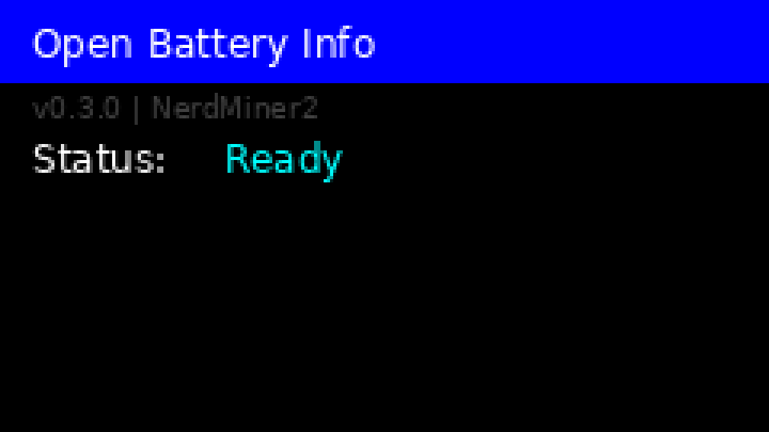
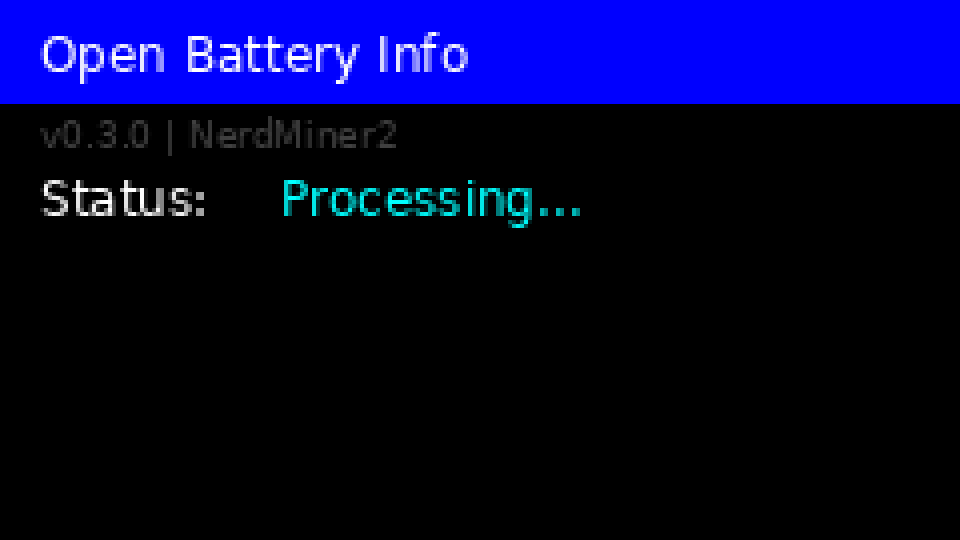
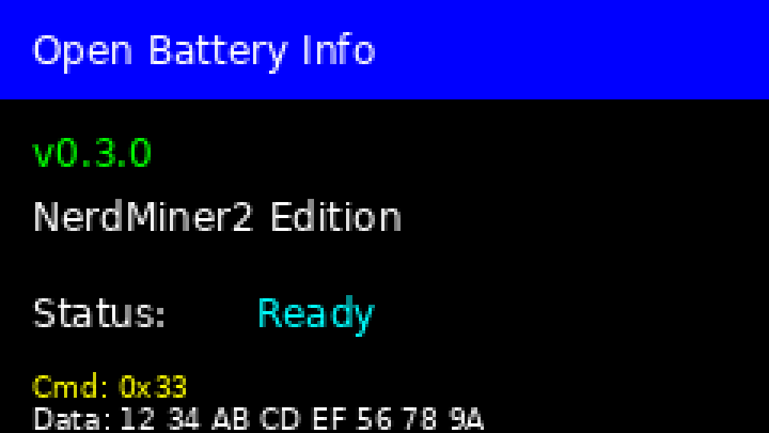
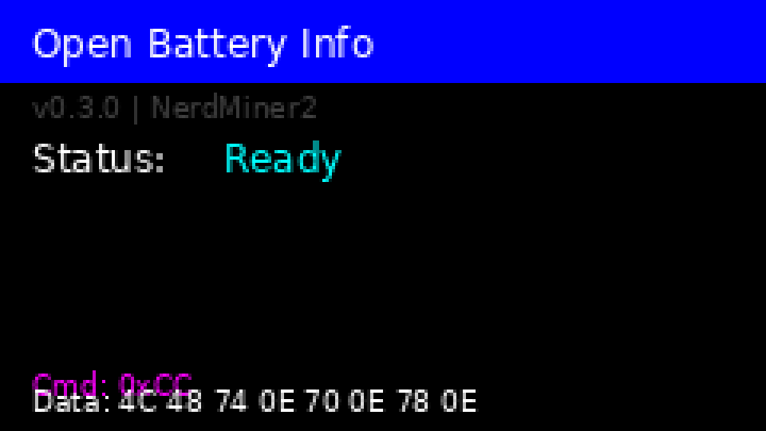

# NerdMiner2 Setup Guide

## Overview

This guide explains how to set up the Open Battery Information system on a NerdMiner2 board, which features an ESP32-S3 microcontroller and a color TFT LCD display.

## Testing Without Hardware - Display Emulator

**Don't have NerdMiner2 hardware yet?** You can preview and test the UI using our display emulator!

The emulator allows you to:
- Visualize the exact display layout without hardware
- Test different display states (Ready, Processing, Battery Data)
- Develop and verify UI changes before flashing to hardware
- Generate preview images for documentation

See the [Display Emulator Documentation](../tools/README.md) for usage instructions.

**Preview Images:**

### Ready State


### Processing State


### Battery Data Display


---

## Hardware Requirements

- **NerdMiner2 Board** with:
  - ESP32-S3 microcontroller
  - ST7789 135x240 pixel TFT color display
  - USB-C port for programming and power
  
- **Battery Interface Components** (same as Arduino version):
  - Resistors for the OneWire interface circuit
  - Battery connector compatible with Makita batteries
  
## Pin Configuration

The NerdMiner2 uses different GPIO pins compared to the Arduino UNO:

| Function | Arduino UNO | NerdMiner2 (ESP32-S3) |
|----------|-------------|------------------------|
| OneWire Data | GPIO 6 | GPIO 21 |
| Enable Pin (RTS) | GPIO 8 | GPIO 22 |
| Display MOSI | N/A | GPIO 23 |
| Display SCLK | N/A | GPIO 18 |
| Display CS | N/A | GPIO 5 |
| Display DC | N/A | GPIO 16 |
| Display RST | N/A | GPIO 17 |
| Display BL | N/A | GPIO 4 |

### Can I Use Different Pins?

**Yes!** The OneWire and Enable pins are configurable. You can change them in two ways:

**Option 1: Via platformio.ini**
```ini
build_flags = 
    -DNERDMINER2
    -DONEWIRE_PIN=<your_pin>
    -DENABLE_PIN=<your_pin>
```

**Option 2: Edit main.cpp**
```cpp
#ifdef NERDMINER2
#define ONEWIRE_PIN 21  // Change to your preferred pin
#define ENABLE_PIN 22   // Change to your preferred pin
#endif
```

**Safe GPIO pins for OneWire on ESP32-S3:**
- GPIO 1-18 (except display pins: 4, 5, 16, 17, 18, 23)
- GPIO 21, 22 (current defaults) ✅ **Recommended**
- GPIO 38-42 (if not used for other purposes)

**Avoid:** GPIO 0 (boot), GPIO 19-20 (USB), GPIO 26-37 (PSRAM), GPIO 43-44 (UART)

### Using Board's Built-in OneWire Pins

Some NerdMiner2 boards may have dedicated OneWire pins labeled "1W", "OneWire", or "DQ". Check your specific board:

1. Look for pin labels on the PCB silkscreen
2. Consult your board's schematic
3. These often connect to GPIO 21 or similar pins
4. May include level shifter for 5V compatibility

If your board has these pins, you can use them directly - they're likely already connected to GPIO 21.

## Wiring Instructions

### OneWire Battery Interface

Connect the battery interface to the NerdMiner2 as follows:

1. **OneWire Data Line (GPIO 21)**:
   - Connect to the battery's data pin through the appropriate resistor network
   - This is the main communication line to the Makita battery

2. **Enable Pin / RTS (GPIO 22)**:
   - Connect to the RTS control circuit
   - This pin controls the enable signal for battery communication

3. **Ground (GND)**:
   - Connect to the battery interface ground
   - Also connect to the battery ground reference

4. **Power (3.3V or 5V)**:
   - Provide appropriate power to the interface circuit
   - The ESP32 can provide both 3.3V and 5V outputs

### Display

The display is already integrated on the NerdMiner2 board, so no additional wiring is needed for the display itself.

## Software Setup

### 1. Install PlatformIO

Follow the instructions in the main README to install PlatformIO IDE or CLI.

### 2. Open the Project

1. Navigate to the `ArduinoOBI` folder
2. Open it in VS Code with PlatformIO installed

### 3. Select the NerdMiner2 Environment

In the PlatformIO sidebar:
- Select the `nerdminer2` environment from the project tasks

### 4. Build the Firmware

- Click "Build" under the `nerdminer2` environment
- Wait for the compilation to complete

### 5. Upload to NerdMiner2

1. Connect your NerdMiner2 to your computer via USB-C
2. Click "Upload" under the `nerdminer2` environment
3. Wait for the upload to complete

## Display Features

The NerdMiner2 version includes a color LCD display that shows parsed battery information in real-time!

### Display Layout



### Header Section (Blue Background)
- **Application Name**: "Open Battery Info"
- **Version**: "v0.3.0 | NerdMiner2" (gray text)

### Status Section (Color-Coded)
- **Status**: Current operation status
  - "Ready" (Cyan) - Waiting for commands
  - "Processing..." (Yellow) - Actively communicating with battery
  - "Initialized" (Cyan) - System just started
  - "Error" (Red) - Communication error

### Battery Data Section (Auto-Parsed)

When battery data is received, the display automatically parses and shows:

**Pack Voltage** (Large, Green)
- Total battery pack voltage (e.g., "Pack: 18.50V")

**Cell Voltages** (Compact, Cyan)
- Individual cell voltages for 5 cells
- Format: "C1:3.70 C2:3.68 C3:3.70"
- Second line: "C4:3.69 C5:3.70 Diff:0.020"
- Voltage difference shows balance status

**Temperature Sensors** (Yellow)
- Two temperature readings
- Format: "Temp1: 25.5C  Temp2: 25.4C"
- Sensor 1: Cell temperature
- Sensor 2: MOSFET/circuit temperature

**Command Information** (Magenta)
- Last command executed (e.g., "Cmd: 0xCC")
- Helps with debugging

### Supported Battery Commands

The display automatically recognizes and parses:

- **0xCC (READ_DATA_REQUEST)**: Shows full battery data with parsed values
- **0x33**: Shows ROM ID and battery message data  
- **Other commands**: Shows raw hex data for debugging

### Display Updates

- Updates occur when Python application sends commands
- No manual refresh needed - automatic parsing
- Color-coded for quick status recognition
- Compact layout fits all info on 135×240 display

### Data Section
- **Command**: Last command sent to the battery (in hexadecimal)
- **Battery Data**: Raw data received from the battery (shown in hex format)

## Serial Communication

The NerdMiner2 maintains full compatibility with the original serial protocol:

- **Baud Rate**: 115200 (higher than Arduino's 9600 due to faster ESP32 clock)
- **Protocol**: Same as Arduino version
- **Commands**: All original commands work identically

You can use the same Python software (OpenBatteryInformation) to communicate with the NerdMiner2.

## Using the Display - Quick Start

### Step 1: Connect Battery
1. Connect your Makita battery to the OneWire interface
2. Ensure proper wiring: GPIO 21 → Data, GPIO 22 → Enable, GND → Ground

### Step 2: Connect to Computer
1. Connect NerdMiner2 to computer via USB-C
2. The display will show "Status: Ready" in cyan

### Step 3: Run Python Application
```bash
cd OpenBatteryInformation
python main.py
```

### Step 4: Select Interface
1. In the application, select "Arduino OBI" from the interface dropdown
2. Choose your NerdMiner2's COM port
3. Click "Connect"

### Step 5: Read Battery Data
1. Select "Makita LXT" from the module dropdown
2. Click "Read battery model"
3. **Watch the display!** It will show:
   - Status changes to "Processing..." (yellow)
   - Battery data appears: voltages, temperatures
   - Status returns to "Ready" (cyan)

### What You'll See on the Display

**During Communication:**
```
┌─────────────────────────┐
│ Open Battery Info       │ (Blue header)
│ v0.3.0 | NerdMiner2     │ (Gray)
│ Status: Processing...   │ (Yellow)
└─────────────────────────┘
```

**After Reading Battery Data:**
```
┌─────────────────────────┐
│ Open Battery Info       │ (Blue)
│ v0.3.0 | NerdMiner2     │ (Gray)
│ Status: Ready           │ (Cyan)
├─────────────────────────┤
│ Pack: 18.50V           │ (Green - Large)
│ C1:3.70 C2:3.68 C3:3.70│ (Cyan)
│ C4:3.69 C5:3.70 Diff:0.020
│ Temp1: 25.5C Temp2: 25.4C (Yellow)
├─────────────────────────┤
│ Cmd: 0xCC              │ (Magenta)
└─────────────────────────┘
```

### Interpreting the Display

**Pack Voltage**: Should match sum of cell voltages (±0.1V)

**Cell Voltages**: 
- Healthy: 3.0V - 4.2V per cell
- Balanced: Diff < 0.05V is good, < 0.02V is excellent
- Unbalanced: Diff > 0.1V may indicate cell degradation

**Temperatures**:
- Normal: 15°C - 45°C
- Charging/Use: May reach 50°C
- Over 60°C: Stop using, battery may be damaged

**Status Colors**:
- Cyan = Normal operation
- Yellow = Processing/busy
- Red = Error condition

## Troubleshooting

### Display Not Working
- Check that the `NERDMINER2` build flag is set in platformio.ini
- Verify the TFT_eSPI library is installed
- Ensure the display pin definitions match your board

### Communication Issues
- Verify GPIO 21 and GPIO 22 are correctly connected
- Check the battery interface circuit
- Ensure the baud rate is set to 115200 in your serial terminal

### Upload Fails
- Make sure the USB-C cable supports data (not just power)
- Try pressing the BOOT button on the NerdMiner2 during upload
- Check that the correct COM port is selected

## Differences from Arduino Version

| Feature | Arduino UNO | NerdMiner2 |
|---------|-------------|------------|
| Microcontroller | ATmega328P | ESP32-S3 |
| Clock Speed | 16 MHz | 240 MHz |
| Serial Baud | 9600 | 115200 |
| Display | None | 135x240 Color TFT |
| OneWire Pin | GPIO 6 | GPIO 21 |
| Enable Pin | GPIO 8 | GPIO 22 |
| Memory | 32KB Flash | 8MB Flash |

## Technical Notes

### Build Flags

The `platformio.ini` file includes specific build flags for the TFT display:
- `ST7789_DRIVER=1`: Uses ST7789 display driver
- `TFT_WIDTH=135`, `TFT_HEIGHT=240`: Display dimensions
- Pin definitions for SPI communication
- Font loading flags

### Conditional Compilation

The code uses `#ifdef NERDMINER2` preprocessor directives to:
- Include TFT library only when building for NerdMiner2
- Use different GPIO pins
- Enable display update functions
- Set appropriate serial baud rate

This ensures the same source code works on both Arduino and ESP32 platforms.

## Additional Resources

- [NerdMiner2 GitHub Repository](https://github.com/BitMaker-hub/NerdMiner_v2)
- [TFT_eSPI Library Documentation](https://github.com/Bodmer/TFT_eSPI)
- [ESP32-S3 Documentation](https://www.espressif.com/en/products/socs/esp32-s3)

## Support

For issues specific to the NerdMiner2 port, please open an issue on the GitHub repository with:
- Your NerdMiner2 board version
- Build output or error messages
- Photos of your wiring setup (if applicable)
